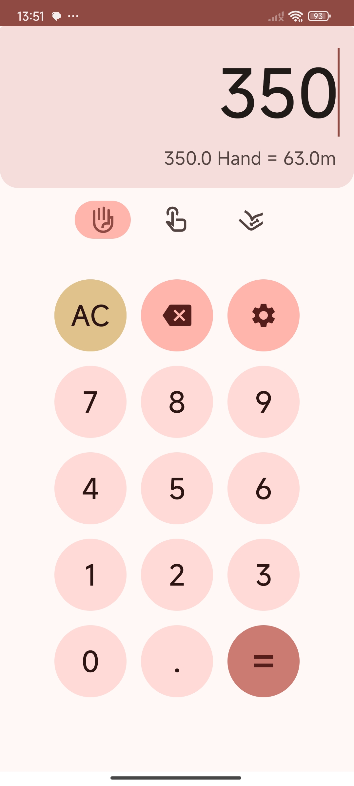
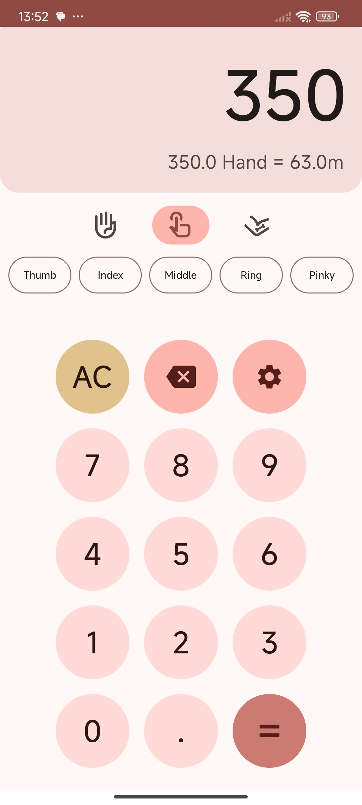
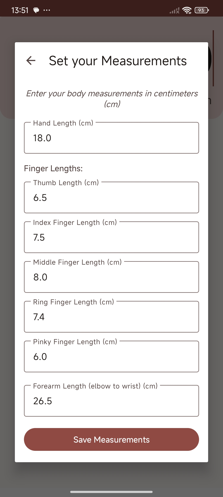

# Handy Measurement Tool

## Personalized Measurement Converter

A simple application that converts personal body measurements into standard metric units. 
Use your own hands, fingers, and forearms as natural measuring tools, then convert them to centimeters and meters with precision.

## Features

- Convert hand lengths to metric units
- Use finger lengths for smaller measurements
- Measure with forearm lengths for larger objects
- Save your personal measurements for consistent conversions
- Quickly calculate dimensions using your body as a reference
- Modern UI with Material 3 components
- Fully compatible with Material U dynamic theming

Perfect for DIY projects, furniture shopping, or any situation where you need a quick estimate without a measuring tape. 
Input your personal measurements once, and convert on the go!

